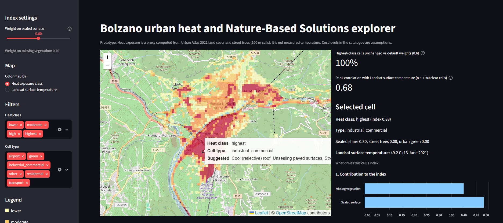
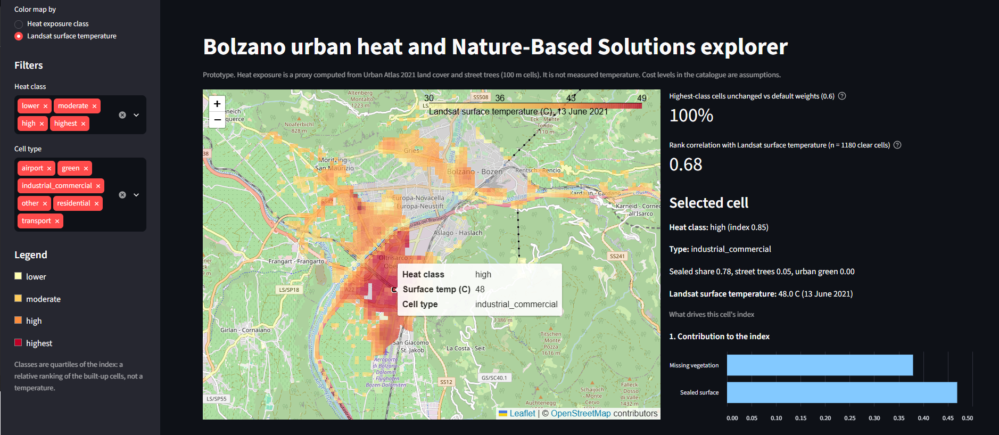
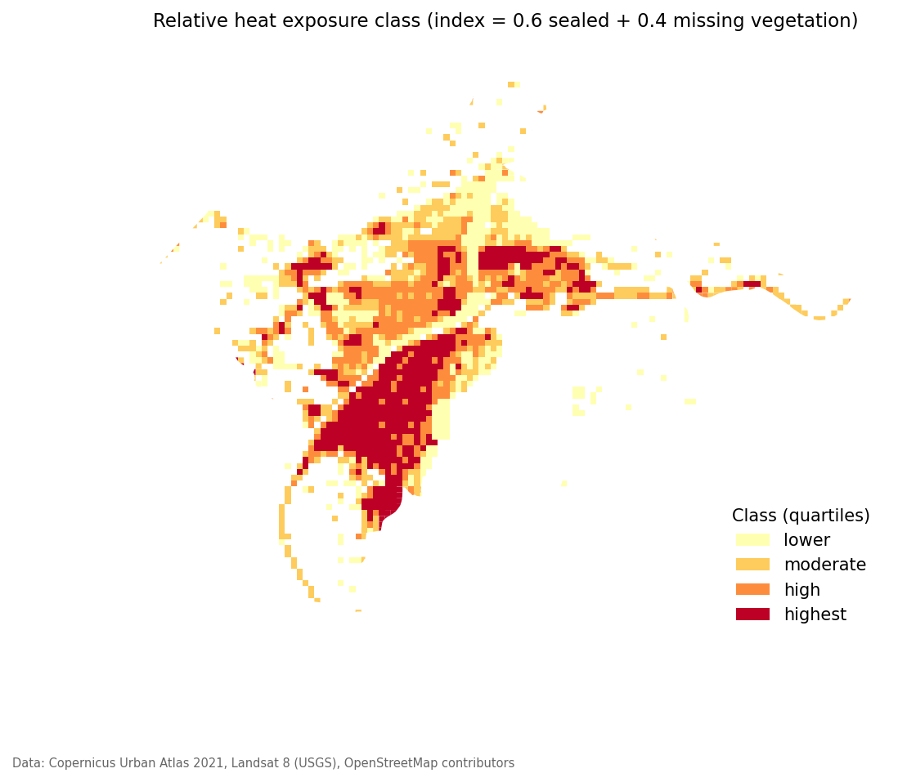
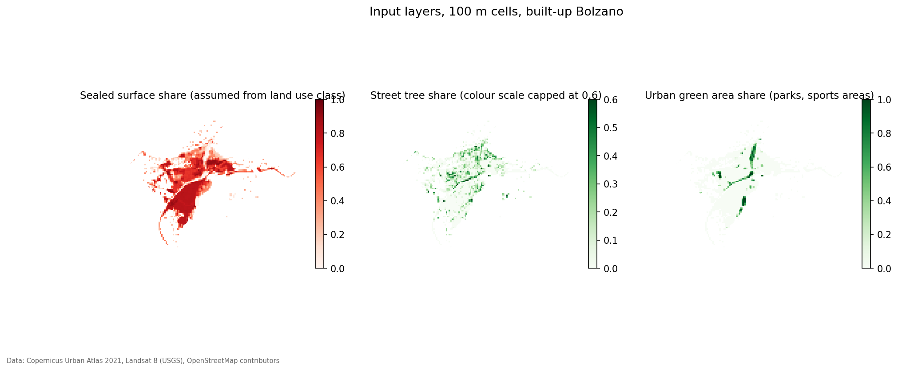
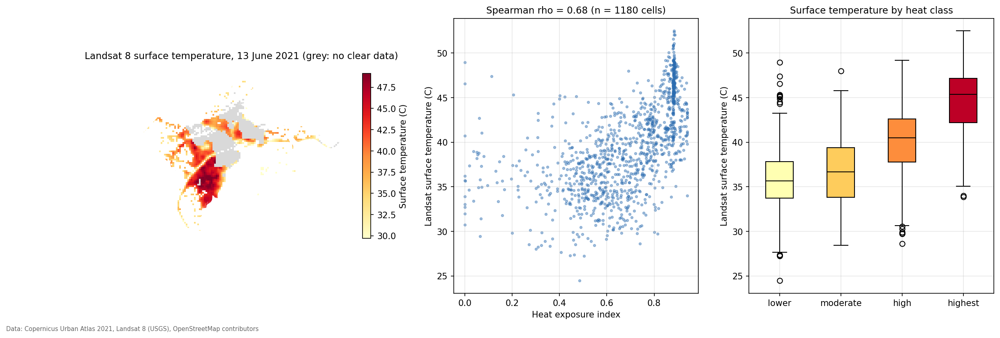
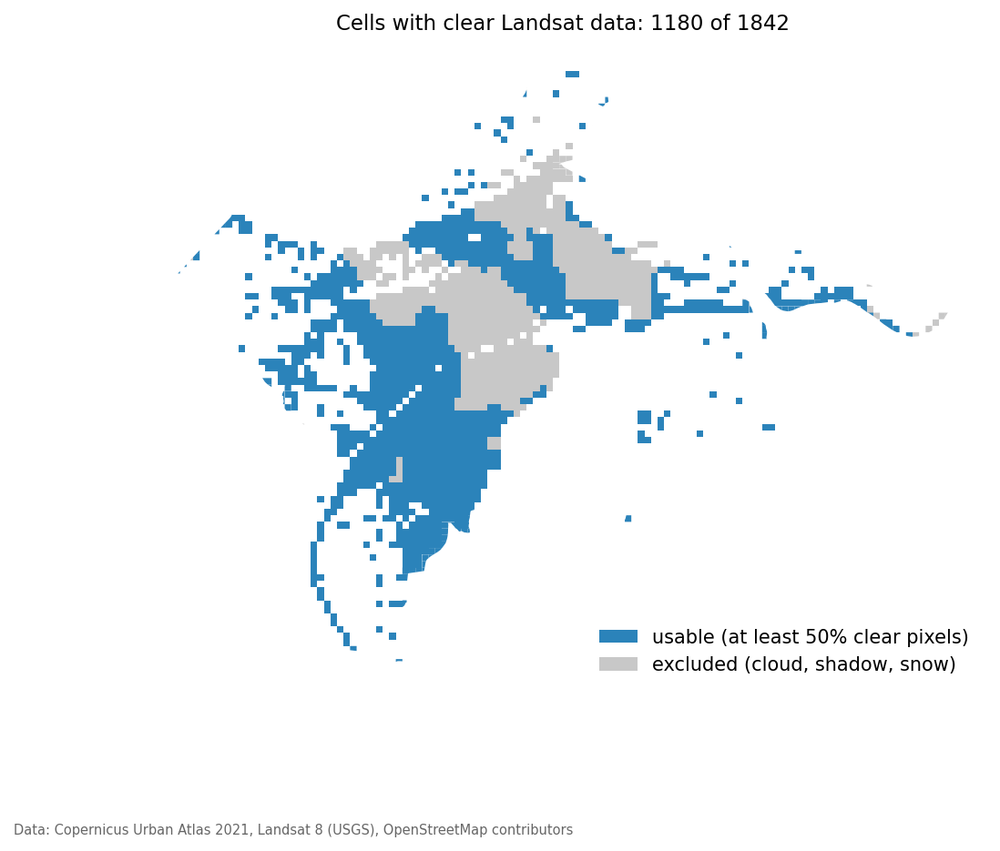

# Bolzano urban heat and Nature-Based Solutions explorer

A small prototype of a decision-support tool for urban heat adaptation. It ranks the built-up part of Bolzano (Italy) in 100 m cells by heat exposure, checks that ranking against satellite-measured surface temperature, and links each high-exposure cell to a referenced catalogue of cooling measures, including Nature-Based Solutions (NbS).

**Live demo:** https://bolzano-urban-heat-nbs-y.streamlit.app/

| Colour by heat exposure class | Colour by Landsat surface temperature |
|---|---|
|  |  |

Independent personal project by Samir Baidar, MSc student in Computing for Data Science (Machine Learning track) at the Free University of Bozen-Bolzano. It is a prototype for learning and demonstration, not an operational planning tool.

## Contents

1. [The question](#the-question)
2. [What the app does](#what-the-app-does)
3. [Main results](#main-results)
4. [Data](#data)
5. [Method](#method)
6. [Validation against Landsat](#validation-against-landsat)
7. [NbS catalogue](#nbs-catalogue)
8. [Limitations](#limitations)
9. [Development notes](#development-notes)
10. [Possible next steps](#possible-next-steps)
11. [Run it locally](#run-it-locally)
12. [Reproducing the data](#reproducing-the-data)
13. [Project structure](#project-structure)
14. [References](#references)
15. [Attribution and licence](#attribution-and-licence)

## The question

Which parts of Bolzano are most exposed to urban heat, and which cooling measures (Nature-Based Solutions or other) could fit each area?

## What the app does

- Shows 1,842 built-up 100 m cells on a map, coloured either by heat exposure class or by measured Landsat surface temperature. Only the built-up part of Bolzano is covered: forests, vineyards and farmland on the slopes are outside the study area.
- Lets you change the weight given to sealed surface versus missing vegetation. The index, classes and recommendations update live.
- Reports a sensitivity check: how many of the highest-class cells stay in the highest class when the weight changes.
- Reports the rank correlation between the index and Landsat surface temperature, recomputed for the chosen weight.
- For a clicked cell, shows its class, its land use type, the contribution of sealed surface and missing vegetation, its measured temperature, and the suggested measures with their evidence and sources. Airport cells are shown but get no suggestion.
- Includes the full NbS catalogue with references.

## Main results



*Relative heat exposure class per 100 m cell. Classes are quartiles of the index, so they rank cells against each other and are not temperatures.*

- The heat exposure index follows measured surface temperature: Spearman rho = 0.68 on 1,180 cells with clear Landsat data (one scene, 13 June 2021). Rho is a rank correlation: +1 means the two rankings agree perfectly and 0 means no relationship.
- The relationship holds inside the main built-up types (rho 0.58 for residential, 0.66 for industrial and commercial, 0.75 for transport), so it is not only a contrast between industrial and residential areas. It does not hold inside the small "other" group (rho 0.06).
- The index separates the hottest cells well (mean surface temperature 44.7 °C in the highest class against 35.8 °C in the lowest), but it separates the two cooler classes poorly (about 1 °C apart).
- The top-class ranking is stable: between 92% and 100% of the highest-class cells stay in that class when the sealed-surface weight moves from 0.3 to 0.9.
- Limits that matter most: one scene, 64% of cells covered, assumed sealing values, and no population data. See [Limitations](#limitations).

## Data

| Data | Source | Terms |
|---|---|---|
| Land Cover / Land Use 2021, Bolzano | [Copernicus Land Monitoring Service, Urban Atlas 2021](https://land.copernicus.eu/en/products/urban-atlas/urban-atlas-2021) | Free and open, attribution requested |
| Street Tree Layer 2021, Bolzano | [Copernicus Land Monitoring Service, Street Tree Layer 2021](https://land.copernicus.eu/en/products/urban-atlas/street-tree-layer-stl-2021) | Free and open, attribution requested |
| Municipality boundary | [OpenStreetMap](https://www.openstreetmap.org/copyright) contributors, retrieved with [OSMnx](https://github.com/gboeing/osmnx) in September 2026 | ODbL |
| Surface temperature | [Landsat 8 Collection 2 Level-2](https://www.usgs.gov/landsat-missions/landsat-collection-2-surface-temperature), scene LC08_L2SP_193028_20210613_20210622_02_T1 (13 June 2021), downloaded from [USGS EarthExplorer](https://earthexplorer.usgs.gov/) | No restrictions on use, citation requested |

Landsat data citation: Earth Resources Observation and Science (EROS) Center (2020), Landsat 8-9 OLI/TIRS Level-2, Collection 2, U.S. Geological Survey, https://doi.org/10.5066/P9OGBGM6.

Product overview: [Urban Atlas](https://land.copernicus.eu/en/products/urban-atlas).

## Method



*The three inputs to the index for each 100 m cell: sealed share (assumed from land use class), street tree share and urban green area share.*

1. **Study area and grid.** A 100 m grid is laid over the Bolzano municipality. Cells with at least 30% artificial surfaces (Urban Atlas class 1xxxx) are kept, which gives 1,842 cells. Forests, farmland and other land on the slopes with little artificial surface are therefore not part of the analysis. Cells at the municipal edge are clipped, so 27 of them cover less than 2,500 m².
2. **Sealed share.** The Urban Atlas urban fabric classes state sealing ranges in their names, and I used the midpoints: continuous 0.90, dense 0.65, medium 0.40, low 0.20, very low 0.05. For other artificial classes I assumed values: isolated structures 0.50, industrial/commercial/public units 0.80, fast roads 0.90, other roads 0.90, railways 0.60, airports 0.80. These assumptions are not measurements.
3. **Vegetation share.** Street trees (Street Tree Layer) plus urban green areas (Urban Atlas class 14xxx), capped at 1.
4. **Heat exposure index.** `index = w * sealed + (1 - w) * (1 - vegetation)`, with a default w of 0.6. The default was set from assumptions before any comparison with satellite data and was not tuned afterwards. Cells are ranked and split into quartiles: lower, moderate, high, highest. The classes are a relative ranking, not a temperature.
5. **Cell types.** Each cell is given the group of its dominant land use:

   | Cell type | Cells | Dominant land use |
   |---|---|---|
   | residential | 646 | Urban fabric classes |
   | industrial_commercial | 577 | Class 12100 |
   | other | 340 | Agricultural, forest, water and similar classes; these cells still have at least 30% artificial surface (45% on average) |
   | green | 117 | Class 14xxx (urban green, sports and leisure) |
   | transport | 111 | Roads and railways |
   | airport | 51 | Class 12400 |

   The cell type is the dominant land use class of the cell, not a measure of vegetation cover. "Green" cells are parks and sports or leisure areas inside the built-up zone. All 117 of them fall in the lowest heat class, although the sports facilities are warmer than the parks in the Landsat data (see the validation section).

   The 51 airport cells (class 12400) are shown and included in the validation, but the app gives them no suggestion, because the industrial roof and paving measures do not fit runways and aprons.

6. **Recommendation rules.** Only for cells in the high and highest classes:
   - industrial/commercial: cool roof, unsealing paving, street trees
   - transport: street trees, reflective pavement
   - residential: street trees, plus green walls and pocket parks where sealing is at least 0.6, or a green corridor otherwise (and next to existing green cells)
   - other: street trees, reflective pavement
   - airport: no suggestion

   These rules are my own design and are not validated.
7. **Validation against Landsat.** Surface temperature is computed from the ST_B10 band using the scale factors in the scene metadata (multiplier 0.00341802, offset 149.0, converted to Celsius). Cloud, cloud shadow, cirrus, snow and fill pixels are masked using QA_PIXEL. Cells with at least 50% clear pixels are kept (1,180 of 1,842) and their mean temperature is compared with the index using Spearman rank correlation.

## Validation against Landsat

The index was built from land cover only and was not fitted to the satellite data, so this is an independent check.



*Left: measured surface temperature per cell (grey: no clear data). Middle: index against surface temperature. Right: surface temperature distribution by heat class.*

**Overall.** Spearman rho = 0.68 between the index and Landsat surface temperature (n = 1,180 cells).

**By heat class.** Mean surface temperature rises with the index class:

| Heat class | Cells | Mean surface temperature (°C) |
|---|---|---|
| lower | 260 | 35.8 |
| moderate | 315 | 36.8 |
| high | 270 | 40.1 |
| highest | 335 | 44.7 |

<details>
<summary><b>By land use type</b> (does the index add information beyond land use?)</summary>

Land use alone explains part of the pattern, since industrial areas are both hot and scored high. To check that the index adds information beyond land use, the correlation is repeated inside each type:

| Cell type | Cells | Rho | Mean surface temperature (°C) |
|---|---|---|---|
| residential | 339 | 0.58 | 38.9 |
| industrial_commercial | 408 | 0.66 | 43.0 |
| transport | 64 | 0.75 | 37.4 |
| airport | 50 | 0.63 | 44.9 |
| green | 57 | 0.32 | 38.1 |
| other | 262 | 0.06 | 34.9 |

Without the "other" group the overall rho is 0.65. The index does not rank cells inside the "other" group, which is mostly agricultural, forest and water land that only partly meets the built-up filter. Within residential cells the two hottest classes are almost the same (40.5 °C for high, 41.1 °C for highest, with only 37 cells in the highest).

</details>

<details>
<summary><b>Sensitivity to the weight</b></summary>

The weight on sealed surface was varied from 0.3 to 0.9:

| Weight on sealed surface | Highest-class cells kept | Rho |
|---|---|---|
| 0.3 | 93% | 0.61 |
| 0.4 | 96% | 0.64 |
| 0.5 | 98% | 0.66 |
| 0.6 (default) | 100% | 0.68 |
| 0.7 | 98% | 0.69 |
| 0.8 | 95% | 0.69 |
| 0.9 | 92% | 0.70 |

The ranking of the hottest cells is stable. Rho rises slightly as more weight goes to sealed surface, so the satellite data do not single out 0.6. I kept 0.6 because it was set beforehand, and choosing the weight that maximises rho on one scene would fit the index to that scene. The weak contribution of the vegetation term may partly reflect missing private gardens, which I have not tested.

</details>

<details>
<summary><b>Which cells have clear data</b></summary>



Cloud and shadow masking removed 662 cells (36%). The grey cells in the map above were excluded. The excluded cells are not a random sample:

| Cell type | Share with clear data |
|---|---|
| airport | 98% |
| other | 77% |
| industrial_commercial | 71% |
| transport | 58% |
| residential | 52% |
| green | 49% |

Excluded cells have a lower mean index (0.63 against 0.68 for included cells) and more mapped vegetation, so the validation leans toward sealed and industrial areas. The highest class is the best covered (73% of its cells).

</details>

<details>
<summary><b>Green cells</b></summary>

Green cells average 38.1 °C, warmer than expected. Splitting them by Urban Atlas class shows why: class 14110 (green urban areas, public access) averages 36.6 °C (39 cells) and class 14200 (sports and leisure facilities) averages 41.3 °C (18 cells). Sports facilities often include paved courts and dry pitches, which may explain the difference, but I have not checked this.

</details>

## NbS catalogue

The catalogue (`data/nbs_catalogue.csv`) holds eight measures with cooling evidence, source, space needed and a cost level. Sources include a review of more than 200 studies (Kumar et al. 2024, The Innovation), a London modelling study (Brousse et al. 2024, Geophysical Research Letters), a Vienna roof modelling study (Žuvela-Aloise et al. 2018), a Vienna Nature-based Solutions modelling abstract (EMS 2023), a Los Angeles simulation of cool pavements (Taleghani et al. 2016), and a multi-criteria study of street trees versus reflective pavements (Janušaitė and Mikučionienė 2026). Full links are in [References](#references). Reported cooling effects vary widely between studies and between local and city-wide scales, and none of the sources are about an Alpine valley city. Cost levels are my own assumptions and are labelled as such.

## Limitations

**Index and data**
- The index is a proxy from land cover, not measured temperature. Landsat gives surface temperature, which is not air temperature or what people feel.
- Sealed shares are assumed values, and the weights are assumptions. Sealed and vegetation shares are correlated (about -0.5), so the weights are not physical quantities.
- Many cells share nearly the same index (215 cells round to 0.88, almost all industrial-type or airport cells with no mapped vegetation), so the index cannot rank within that group.
- 43% of cells have no mapped vegetation. Private gardens and trees outside the Street Tree Layer are missing, so the vegetation term partly reflects missing data.
- Class 12100 (industrial, commercial, public and private units) includes non-factory buildings, so cool roof suggestions need on-site checks.
- The index picks out the hottest cells much better than it separates the cooler ones: the two lowest classes differ by only about 1 °C.
- 27 cells at the municipal edge are clipped slivers under 2,500 m², and their shares rest on very little area.

**Validation**
- One scene (13 June 2021, about 10:05 UTC, roughly midday local time), covering 64% of cells. Results on other dates or seasons may differ.
- Coverage is uneven: about half of residential and green cells have clear data, against 71% of industrial ones. The coverage map in the validation section shows where the excluded cells lie.
- Cell-level values are spatially autocorrelated, so the rank correlation should be read as descriptive and not as a formal significance test.
- The index does not rank cells inside the "other" group (rho = 0.06).

**Recommendations**
- The matching rules are a simple rule set and not a validated model. The tool does not estimate the effect of any intervention.
- The rules do not cover airport land, so the 51 airport cells get no suggestion.
- Cost levels are assumptions, not estimates.

**Scope**
- No population data, so this shows exposure, not vulnerability.

## Development notes

- The first version of the vegetation layer counted forests and farmland as green, which turned the slopes dark green and hid differences inside the city. It now uses only urban green areas and street trees, inside the built-up cells.
- The first heat classes used fixed thresholds and put 52% of cells in the top class, so the classes are now quartiles (a relative ranking).
- The default weights were fixed before the satellite comparison and not changed afterwards.
- Catalogue figures for the London, Vienna roof and street tree versus pavement studies were checked against the papers' abstracts. The Kumar review figures were checked against summaries of the paper and the park figure only against press coverage, so both should be verified against the full text before being relied on.

## Possible next steps

- Add more Landsat scenes and dates.
- Use building footprints to identify large flat roofs for cool roof suggestions.
- Add population data to move from exposure to vulnerability and to prioritise areas.
- Replace assumed sealing values with an imperviousness dataset.
- Add a mock survey and a short user guide for municipal planners.

## Run it locally

Tested with Python 3.12.

```
pip install -r requirements.txt
streamlit run app.py
```

Data files needed in `data/`: `bolzano_with_lst.gpkg` (cells with index, classes, recommendations and Landsat temperature), `bolzano_recommendations.gpkg` (fallback without temperature) and `nbs_catalogue.csv`.

## Reproducing the data

The raw downloads are not included in the repository. To rebuild the data files:

<details>
<summary><b>1. Download the inputs</b></summary>

**Urban Atlas (free Copernicus account needed).** Open the [Land Cover/Land Use 2021](https://land.copernicus.eu/en/products/urban-atlas/urban-atlas-2021) and [Street Tree Layer 2021](https://land.copernicus.eu/en/products/urban-atlas/street-tree-layer-stl-2021) pages, go to the download section, and choose the pre-packaged file for Bolzano (functional urban area code IT034L1). The files used were:
- `CLMS_UA_LCU_S2021_V025ha_IT034L1_BOLZANO_03035_V01_R00_20241025.fgb`
- `CLMS_UA_STL_S2021_V005ha_IT034L1_BOLZANO_03035_V01_R02_20251121.fgb`

**Landsat (free USGS account needed).** In [EarthExplorer](https://earthexplorer.usgs.gov/), search around Bolzano (46.4983 N, 11.3548 E) for June to August 2021 with low cloud cover, choose the dataset Landsat 8-9 OLI/TIRS C2 L2, and select scene `LC08_L2SP_193028_20210613_20210622_02_T1`. Under the surface temperature bands, download `ST_B10.TIF`, `QA_PIXEL.TIF` and the `MTL.txt` metadata file.

</details>

<details>
<summary><b>2. Run the pipeline</b></summary>

Install the extra packages the pipeline needs:

```
pip install geopandas pyogrio shapely osmnx rasterio rasterstats scipy matplotlib pandas numpy
```

Run the scripts in `pipeline/` in this order:

1. `grid_v1.py`
2. `grid_v2.py`
3. `heat_index.py`
4. `heat_index_v2.py`
5. `cell_types.py`
6. `recommend.py`
7. `landsat_validation.py`

`validation_checks.py` reproduces the tables in the validation section from `bolzano_with_lst.gpkg`, and `make_figures.py` regenerates the images in `docs/`:

```
python pipeline/validation_checks.py data/bolzano_with_lst.gpkg
python pipeline/make_figures.py
```

Paths inside the scripts point to a local Windows folder and need adjusting. The municipality boundary is downloaded from OpenStreetMap when `grid_v1.py` runs, so the result can change slightly if OpenStreetMap changes.

</details>

## Project structure

```
.
├── app.py                  Streamlit dashboard
├── requirements.txt
├── LICENSE
├── data/
│   ├── bolzano_with_lst.gpkg
│   ├── bolzano_recommendations.gpkg
│   └── nbs_catalogue.csv
├── docs/                   screenshots and figures used in this README
└── pipeline/               scripts that build the data files and figures
```

## References

Cooling evidence used in the NbS catalogue.

- Brousse, O., Simpson, C., Zonato, A., Martilli, A., Taylor, J., Davies, M., & Heaviside, C. (2024). Cool roofs could be most effective at reducing outdoor urban temperatures in London (United Kingdom) compared with other roof top and vegetation interventions: A mesoscale urban climate modeling study. Geophysical Research Letters, 51(13), e2024GL109634. https://doi.org/10.1029/2024GL109634
- Kumar, P., Debele, S. E., Khalili, S., et al. (2024). Urban heat mitigation by green and blue infrastructure: Drivers, effectiveness, and future needs. The Innovation, 5(2), 100588. https://doi.org/10.1016/j.xinn.2024.100588
- Žuvela-Aloise, M., Andre, K., Schwaiger, H., Bird, D. N., & Gallaun, H. (2018). Modelling reduction of urban heat load in Vienna by modifying surface properties of roofs. Theoretical and Applied Climatology, 131. https://doi.org/10.1007/s00704-016-2024-2
- Žuvela-Aloise, M., Hahn, C., Bügelmayer-Blaschek, M., & Schneider, M. (2023). Modelling the cooling effect of Nature-based Solutions in densely built-up areas for a case study Vienna, Austria. EMS Annual Meeting Abstracts, 20, EMS2023-316. https://doi.org/10.5194/ems2023-316
- Taleghani, M., Sailor, D., & Ban-Weiss, G. A. (2016). Micrometeorological simulations to predict the impacts of heat mitigation strategies on pedestrian thermal comfort in a Los Angeles neighborhood. Environmental Research Letters. https://pdxscholar.library.pdx.edu/mengin_fac/91
- Janušaitė, P., & Mikučionienė, R. (2026). Sustainability assessment of urban heat island mitigation measures in street environments: an analysis of street trees and cool pavements. Mokslas - Lietuvos ateitis / Science - Future of Lithuania, 18. https://doi.org/10.3846/mla.2026.27186

Data documentation: [Urban Atlas](https://land.copernicus.eu/en/products/urban-atlas), [Landsat Collection 2 surface temperature](https://www.usgs.gov/landsat-missions/landsat-collection-2-surface-temperature).

## Attribution and licence

Contains data from the Copernicus Land Monitoring Service (Urban Atlas 2021), Landsat 8 Collection 2 Level-2 data courtesy of the U.S. Geological Survey, and OpenStreetMap contributors (municipality boundary and basemap, ODbL).

Code licence: MIT (see `LICENSE`).